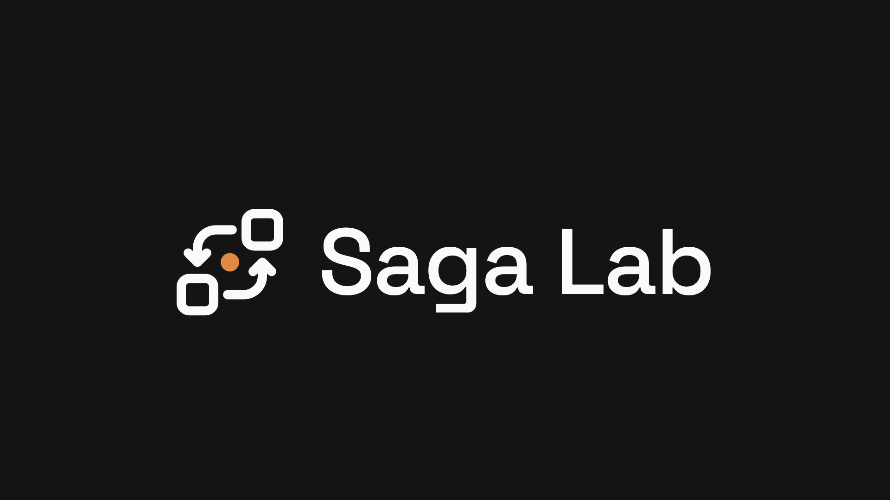
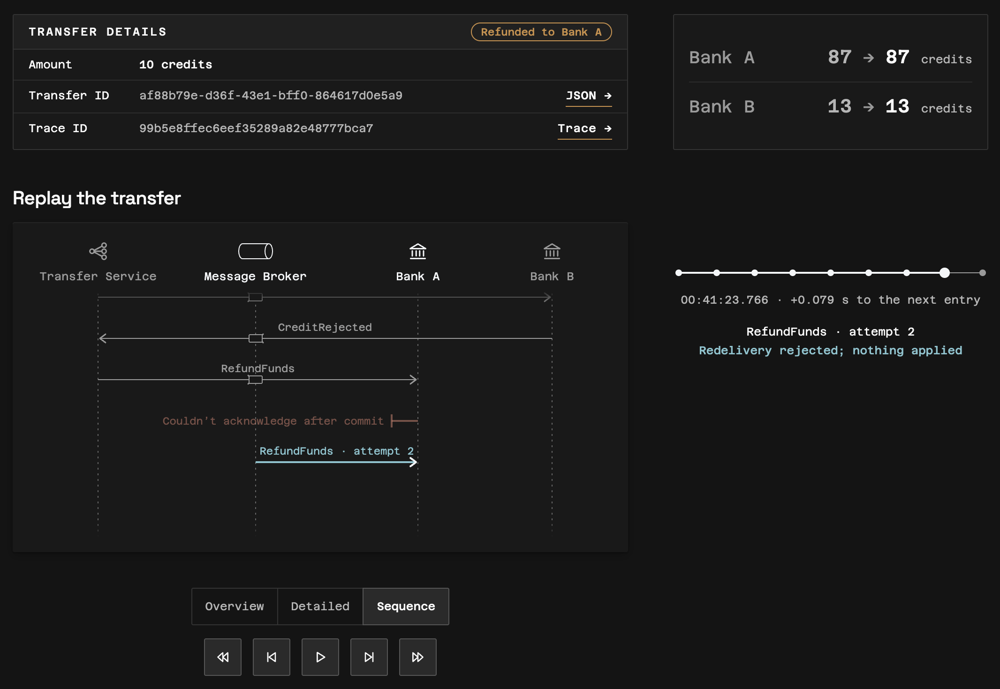

<p align="center">
  <a href="https://saga.dinubarbu.com"></a>
</p>

<p align="center">
  A live demonstration of orchestrated Sagas.<br/>
  Transfers that stay consistent across two independent banks, <br/>
  with the evidence to <strong>prove</strong> it and visualisations to <strong>understand</strong> it.
</p>

<p align="center">
  <a href="docs/README.md">Docs</a> ·
  <a href="docs/architecture.md">Architecture</a> ·
  <a href="docs/scenarios.md">Scenarios</a> ·
  <a href="docs/observability.md">Observability</a>
</p>

<p align="center">
  <a href="https://github.com/dvinubius/saga-lab/releases/tag/v1"></a>
  <a href="go.mod"></a>
  <a href="LICENSE"></a>
</p>

<h3 align="center">
  <a href="https://saga.dinubarbu.com">https://saga.dinubarbu.com</a>
</h3>

# Saga Lab

<p align="center">
  
</p>

A Transfer Service moves fictional credits from Bank A to Bank B. The two
banks own their own databases, so no transaction can span a transfer. Instead
the Transfer Service orchestrates it as a **Saga**: each bank commits its own
local step, the steps are joined by messages through RabbitMQ, and a credit
Bank B rejects is compensated by a refund rather than rolled back.

Each visitor gets an account at each bank, 100 credits at Bank A and 0 at
Bank B, picks a scenario, makes a transfer and watches it run. Five scenarios
show what can go wrong in a message-driven system and how this one stays
consistent:

- **Happy path**: debit, credit, done.
- **Debit redelivery**: Bank A's acknowledgement is lost after it commits the
  debit; the broker redelivers it, and the bank's inbox recognises the
  duplicate and applies nothing.
- **Credit rejection & refund**: Bank B refuses the credit; the Transfer
  Service compensates with a refund to Bank A.
- **Bank B unavailable**: the credit command waits in the broker with no
  consumer for a few seconds, then is delivered and applied.
- **Credit rejection & refund redelivery**: the refund's acknowledgement is
  lost too, and the refund is still applied exactly once.

Every transfer leaves an execution history recorded by the services
themselves, a replay of it, an outcome summary counting each command's
handling attempts and committed effects, and a link to its distributed trace
in a read-only Grafana. The point is not that it works on a good day, but that
a reviewer can see *why* it stays correct on a bad one: every state change is
committed together with its outgoing messages (an outbox per service), every
command is applied at most once (an inbox per bank), and duplicate effects are
counted to show there are none. See [scenarios and invariants](docs/scenarios.md).

Behind the page sits a small production deployment: three Go services, one
services image published to GHCR by digest, PostgreSQL, RabbitMQ, the
OpenTelemetry Collector, Tempo and Grafana, memory-bounded on a shared VPS
behind the [hetzner-one](https://github.com/dvinubius/hetzner-one) Caddy. A
tested pipeline deploys every push to `main`, checks the release from inside
and from the internet by running all five scenarios against the public site,
and restores the previous deployment if any check fails. Visitors expire after
a week unseen; terminal transfers and their histories disappear seven days
after request time. Pending transfers are protected.

## Run locally

Requires Docker with Compose v2.

```bash
make up      # build and start everything, wait until ready
```

Open <http://localhost:8080>; Grafana is at <http://localhost:3000/grafana/>.
`make reset` clears all visitors and transfers, `make down` stops the stack.
See [development](docs/development.md) for ports, configuration and the demo
reset.

## Test

Requires Go 1.27 and Docker.

```bash
make test                               # Go and acceptance tests
scripts/test.sh -short                  # the fast loop: no Compose-backed tests
make test-deploy                        # deployment script tests
scripts/smoke.sh http://localhost:8080  # all five scenarios against a running stack
```

## Documentation

- [Documentation routing index](docs/README.md)
- [Architecture](docs/architecture.md)
- [Scenarios and invariants](docs/scenarios.md)
- [Observability](docs/observability.md)
- [HTTP API](docs/http-api.md)
- [Development](docs/development.md)
- [Security](docs/security.md)
- [Limitations and known gaps](docs/limitations.md)
- [Deployment runbook](docs/deployment-runbook.md)
- [Design system](.agents/design-system.md)
- [Glossary](GLOSSARY.md)
- [Architecture decision records](docs/adr/)

## License

[MIT](LICENSE)
