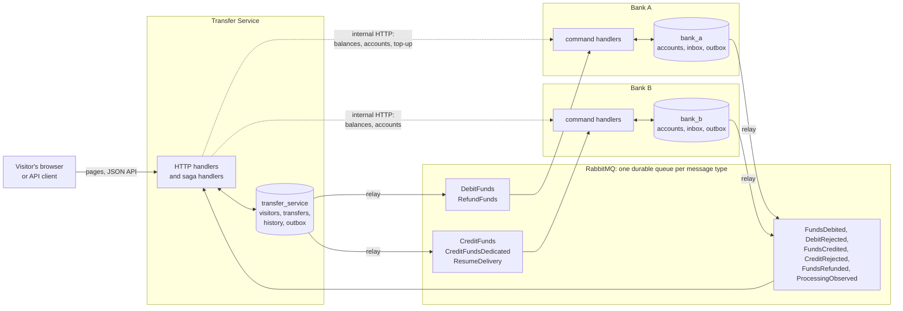

# Architecture

This document describes Saga Lab's services, how they exchange messages, and
where each one keeps its state. The [scenarios](scenarios.md) describe what a
transfer does under each scenario, [observability](observability.md) how a
transfer is traced, and the [HTTP API](http-api.md) the wire contract.

## System shape

Three Go services, one PostgreSQL server and one RabbitMQ broker, built from
one services image:

- **Transfer Service**, the Saga's orchestrator. It serves the pages and the
  JSON API, identifies visitors, records transfers and their execution
  histories, sends commands to the banks and reacts to their replies.
- **Bank A**, the source bank. It owns Bank A accounts, applies debits and
  refunds, and adds top-ups.
- **Bank B**, the destination bank. It owns Bank B accounts and applies or
  rejects credits.

No transaction spans two services. Each service owns its database on the
shared PostgreSQL server (`transfer_service`, `bank_a`, `bank_b`) and connects
with its own login role, which can open only that database. The Transfer
Service reads balances and opens, tops up and closes accounts over the banks'
internal HTTP; everything that belongs to a transfer travels through
RabbitMQ.

Each service also sends OpenTelemetry traces to the OpenTelemetry Collector,
which forwards them to Tempo; Grafana reads Tempo (see
[observability](observability.md)).

## Messages

Messages are JSON, published through [Watermill](https://watermill.io) to one
durable RabbitMQ queue per message type.

| Message | From | To | Meaning |
| --- | --- | --- | --- |
| `DebitFunds` | Transfer Service | Bank A | debit the visitor's Bank A account |
| `FundsDebited` / `DebitRejected` | Bank A | Transfer Service | the debit committed / was refused (insufficient funds) |
| `CreditFunds` | Transfer Service | Bank B | credit the visitor's Bank B account |
| `FundsCredited` / `CreditRejected` | Bank B | Transfer Service | the credit committed / was refused |
| `RefundFunds` | Transfer Service | Bank A | restore the debited amount |
| `FundsRefunded` | Bank A | Transfer Service | the refund committed |
| `ResumeDelivery` | Transfer Service | Bank B | start consuming the dedicated credit queue for one transfer |
| `ProcessingObserved` | either bank | Transfer Service | a processing observation for the execution history |

Every message has its own message ID. A reply or observation carries the ID
of the message that caused it (its causation ID), and the transfer ID travels
in its metadata, so a transfer's chain of messages can be followed in its
history and its trace. A **Bank B unavailable** transfer's `CreditFunds` goes
to the `CreditFundsDedicated` queue instead, which only Bank B's dedicated
consumer reads ([ADR 0002](adr/0002-dedicated-consumer-off-at-rest.md)).

## Outbox and relay

Every service commits each state change together with the messages it causes:
the transaction that changes a balance or a transfer's status also inserts the
outgoing messages into that service's `outbox` table. A relay in each service
polls its outbox every 100 ms, publishes rows in order through a publisher
that waits for the broker's confirmation, and deletes each row once it is
confirmed. A failed publication is retried with a backoff capped at one
second, so a broker outage delays a transfer but never strands it. Because a
row can be published again after a crash between confirmation and deletion,
publication is at least once
([ADR 0001](adr/0001-own-outbox-relay-over-watermill-forwarder.md)).

The Transfer Service's relay also tells the service when a dedicated
`CreditFunds` is confirmed, in the same transaction that deletes its outbox
row; that moment becomes the transfer's `CreditConfirmed` observation and
starts its delivery wait.

## Inbox and duplicate suppression

The banks record each command they apply in an `inbox` table keyed by message
ID, in the same transaction as the command's effect and its outgoing reply. A
command whose ID is already in the inbox is acknowledged without being applied
again, and the bank reports a `DuplicateSuppressed` observation. This is what
makes a redelivered command safe; the redelivery scenarios show it. Each bank
deletes inbox entries received more than seven days ago, hourly.

The Transfer Service keeps no inbox. Each bank event moves a transfer out of
one specific status, so a repeated event no longer matches and changes
nothing; history entries are unique by message ID, so a repeated observation
is recorded once.

A handler that fails rejects its message, which RabbitMQ redelivers at once,
without backoff.

## Transfer Service state

- **Visitors**: one row per visitor ID with its last-seen time
  ([security](security.md#visitor-token) explains the ID).
- **Transfers**: amount, scenario, status, rejection reason, trace ID and the
  trace context to continue it in, and for Bank B unavailability the
  confirmation and resume times. A partial unique index admits at most one
  pending transfer per visitor (the pending-transfer restriction).
- **Execution history**: steps and processing observations per transfer.
- **Demonstration slot**: a single row naming the Bank B unavailable transfer
  that holds it, locked by every transaction that claims, checks or releases
  it.
- **Account closures**: bank accounts still to be deleted after a visitor
  reset or expiry, retried until both banks confirm.

Background loops in the Transfer Service: the outbox relay, the resume
schedule (every 100 ms, issues `ResumeDelivery` once a transfer's resume time
has passed) and the visitor expiry sweep.

## Bank state

Each bank keeps `accounts` (visitor ID, balance), `inbox` and `outbox`. Bank A
opens accounts with 100 credits and offers a top-up of 100; Bank B opens
accounts with 0. Opening an account never overwrites an existing balance.

Bank B also runs the dedicated consumer of `CreditFundsDedicated` on a channel
it owns with a prefetch of one. It is off at rest, registered by a
`ResumeDelivery` and cancelled after the one credit it serves.

## Deployment shape

Locally, Compose runs all eight containers with host ports on `127.0.0.1`
([development](development.md)). In production the same images run on a shared
VPS behind the [hetzner-one](https://github.com/dvinubius/hetzner-one) Caddy,
which terminates TLS for `saga.dinubarbu.com` and proxies `/grafana/*` to
Grafana and everything else to the Transfer Service over the external
`saga-lab-edge` network. No other container is reachable from outside; see
[security](security.md) and the [deployment runbook](deployment-runbook.md).
