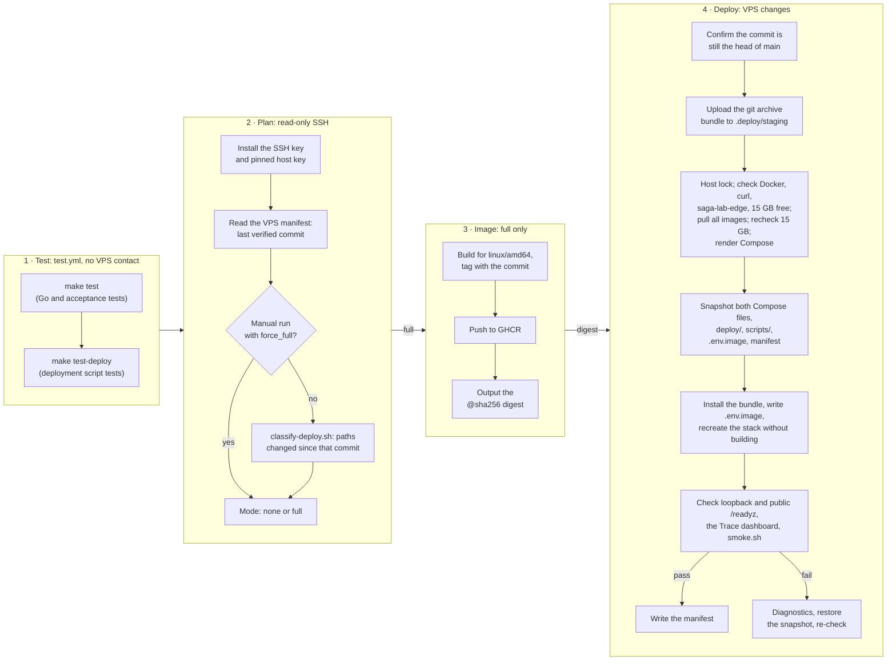

# Deployment runbook

Pushes to `main` deploy Saga Lab to the shared VPS through the
[`Deploy production`](../.github/workflows/deploy.yml) workflow. The VPS pulls
one published services image from GHCR; it never clones the repository and
never builds.

Saga Lab ships no public ingress. TLS, the `saga.dinubarbu.com` route, the
`/grafana` sub-path, the rate limits and the `saga-lab-edge` Docker network
belong to [hetzner-one](https://github.com/dvinubius/hetzner-one), the VPS's
shared Caddy at `/opt/caddy`. Without it a deployment stops at the
`saga-lab-edge` check. This runbook does not provision the VM, install
Docker, configure DNS or change Caddy.

## How a push deploys

Every push to `main` starts a run. The plan decides whether anything reaches
the VPS; a run whose mode is `none` stops there.



1. **Test.** The [`Test`](../.github/workflows/test.yml) workflow: `make test`
   and `make test-deploy`. Nothing contacts the VPS before these pass.
2. **Plan.** Runs in the `production` environment and the `production-deploy`
   concurrency group, so one production run happens at a time. It reads
   `/opt/saga-lab/.deploy/manifest` over SSH with the pinned host key and
   passes the last verified commit to
   [`classify-deploy.sh`](../scripts/classify-deploy.sh):

   | Changed since the last verified deployment | Mode |
   | --- | --- |
   | Only docs, agent notes (`AGENTS.md`, `CLAUDE.md`, `.agents/`), `README.md`, `GLOSSARY.md`, `LICENSE`, tests (`*_test.go`, `acceptance/`, `scripts/*_test.sh`, `scripts/test.sh`, `compose.test.yaml`), `Makefile`, `.env.example`, `.gitignore`, `.ignore` | none |
   | Anything else: Go code, `Dockerfile`, either Compose file, `deploy/`, operational scripts, workflows, any unlisted path | full |
   | No manifest, or its commit is not an ancestor of the target | full |

   If SSH or Git inspection fails, the run stops without changing production.
   A `none` run leaves the manifest unchanged, so those paths are seen again
   next time; a failed deployment does too, so the next run covers both.
3. **Image** (full only). Builds the [`Dockerfile`](../Dockerfile) for
   `linux/amd64`, labels it with `org.opencontainers.image.source`, pushes
   `ghcr.io/dvinubius/saga-lab:<commit>`, and passes on the immutable
   `ghcr.io/dvinubius/saga-lab@sha256:…` reference. Only this job can write
   packages. The Transfer Service, Bank A and Bank B all run this one image.
4. **Deploy.** Confirms the commit is still the head of `main` (otherwise the
   run is stale and a newer run deploys), creates a bundle with `git archive`
   from that exact commit (`compose.yaml`, `compose.production.yaml`,
   `deploy/`, and `scripts/compose.sh`, `scripts/remote-deploy.sh`,
   `scripts/smoke.sh`), uploads it to `/opt/saga-lab/.deploy/staging/<commit>`
   and runs its [`remote-deploy.sh`](../scripts/remote-deploy.sh).

The remote script, under a host lock:

- checks Docker with Compose, `curl`, the `saga-lab-edge` network and at least
  15 GB free on Docker's data root; pulls the exact digest with the run's
  short-lived `GITHUB_TOKEN` in a throwaway Docker config, deleted after the
  pull; renders the bundled Compose files with the live `.env`; pulls all
  missing dependency images; and checks the remaining 15 GB headroom again.
  None of this changes the live files or containers.
- snapshots the live `compose.yaml`, `compose.production.yaml`, `deploy/`,
  `scripts/`, `.env.image` and manifest into
  `/opt/saga-lab/.deploy/snapshots/<time>-full` (five kept after successful and
  failed attempts; the active restore snapshot and manual rollback source are
  protected while verification runs);
- installs the bundle, writes `.env.image` atomically, and runs
  `up --detach --no-build --wait --force-recreate` (every configuration file
  is bind-mounted, so every container is recreated; volumes are kept);
- checks `http://127.0.0.1:8090/readyz`, `https://saga.dinubarbu.com/readyz`,
  that `https://saga.dinubarbu.com/grafana/api/dashboards/uid/saga-lab-trace`
  serves the Trace dashboard to an anonymous visitor, and
  `scripts/smoke.sh https://saga.dinubarbu.com`;
- only after every check passes writes the mode-0600 manifest (`commit`,
  `image`, `mode`, `deployed_at`).

On a failed check it prints bounded diagnostics (`ps` and the last 50 log
lines per service), restores the snapshot, recreates the stack and runs the
same checks; a restore that also fails is reported as `ROLLBACK FAILED`. A
failed first deployment has nothing to restore: it leaves the failed stack
for inspection and writes no manifest, so the next run is full again.

Deployment never touches `.env`, the volumes, Caddy, Hooklook or zibs, and
never runs `docker compose down`.

The smoke run sends five or six POSTs as one new visitor, within Caddy's
20 POSTs a minute per address. A failed check followed by a restore runs it
twice. If the Bank B unavailable demonstration is busy, its step is skipped
with a warning rather than failing the deployment.

## One-time setup

In this order:

1. **Hetzner-one first.** Merge and deploy hetzner-one's Saga Lab change
   (its [deployment runbook](https://github.com/dvinubius/hetzner-one/blob/main/docs/deployment-runbook.md)).
   It creates `saga-lab-edge`, obtains the `saga.dinubarbu.com` certificate
   and proxies the site to `saga-lab:8080` and `/grafana/*` to
   `saga-lab-grafana:3000`. DNS for `saga.dinubarbu.com` must already point
   at the VPS. Until Saga Lab joins the network, the site answers `502`.
   Hetzner-one's `verify.sh` fails its deployment on any Caddy error log, and
   each request to the unbacked site logs an upstream error: do not request
   `saga.dinubarbu.com` until the hetzner-one run has finished, retry that run
   if a stray request rolled it back, and deploy Saga Lab soon after so the
   `502` window stays short. Never run a hetzner-one and a Saga Lab
   deployment at the same time: Saga Lab's recreate also produces `502`s.
2. **GitHub repository:** the `production` environment and branch
   protection.
3. **VPS:** the `saga-lab-deploy` account (already created) with its key, and
   `/opt/saga-lab/.env`.
4. **First deployment:** merge to `main`, then make the GHCR package public.

The [release checklist](#release-checklist) below lists the exact commands.

### GitHub repository

The workflow expects a GitHub environment named `production` holding:

| Name | Kind | Value |
| --- | --- | --- |
| `DEPLOY_SSH_KEY` | secret | Private key of the dedicated deployment key pair |
| `DEPLOY_HOST` | variable | VPS address |
| `DEPLOY_USER` | variable | `saga-lab-deploy` |
| `DEPLOY_KNOWN_HOSTS` | variable | Verified `known_hosts` line(s) for `DEPLOY_HOST` |

Deployments are allowed from `main` only. Branch protection on `main` forbids
force pushes and deletion and requires the `test` check, which the `Test`
workflow reports on every pull request into `main`; `Deploy production`
reuses the same workflow as its first job. A rewritten `main` leaves the
manifest's commit off the branch's history, which the classifier treats as a
full deployment.

GHCR publication uses the workflow's `GITHUB_TOKEN`. The package is linked to
the repository through its `org.opencontainers.image.source` label and made
public after the first push, so anyone can pull it. The VPS still pulls with
the run's short-lived `GITHUB_TOKEN` and needs no PAT or Git credential.

### VPS deployment account

`saga-lab-deploy` is used only for deployment, belongs to the `docker` group
and owns `/opt/saga-lab`. Docker group membership is effectively host-level
privilege, so its key must be dedicated, never the operator's general key.
`flock` (util-linux), `curl`, Docker and the Compose plugin (2.24 or newer,
for `!reset` and `!override`) must be installed. SSH hardening and fail2ban
are already in place for Hooklook's identical setup; if `sshd -T` lists
`allowusers` or `allowgroups`, add `saga-lab-deploy` there.

### Runtime secrets

`/opt/saga-lab/.env` holds the PostgreSQL, service role, RabbitMQ and Grafana
admin secrets documented in [`.env.example`](../.env.example). It is mode
0600, owned by `saga-lab-deploy`, and never leaves the VPS. PostgreSQL and
RabbitMQ apply their passwords only when their volumes are first created;
changing one later needs `ALTER ROLE` or `rabbitmqctl change_password` as
well. Grafana has no volume, so its admin password applies on every start.
After editing `.env`, run `./scripts/compose.sh up --detach --no-build --wait`.

### Host capacity

Saga Lab needs at least 15 GB free on Docker's data root at every deployment:
Hooklook's 12 GB deploy allowance plus 3 GB platform headroom, the same rule
Hooklook's own check enforces. Before release the host's Docker build cache
was pruned (`docker builder prune`), leaving about 26 GB free; Saga Lab adds
roughly 0.8 GB of images and 0.5 GiB of memory. The script checks before
and after all image pulls, before live changes; manual rollback does the same.
Automatic recovery reuses the previous deployment without making a new
headroom check a barrier to restoring it. If the check refuses a
deployment, free space (old images, build cache) rather than lowering it.

## Release checklist

For the first release, after this repository's milestone 7 work and
hetzner-one's Saga Lab change are ready. Commands marked *workstation* run
from a checkout with an authenticated `gh`; *VPS* commands run as root.

### 1. Hetzner-one deployed

Merge [hetzner-one#2](https://github.com/dvinubius/hetzner-one/pull/2) and
let its `Deploy production` run finish (see the ordering note in
[One-time setup](#one-time-setup)).

If its first deployment failed with `lookup saga-lab ... server misbehaving`,
Saga Lab has no container on the edge network yet. An external request during
Caddy verification logged a 502 and triggered its rollback. On the workstation,
rerun the Caddy deployment:

```bash
gh workflow run deploy.yml --repo dvinubius/hetzner-one --ref main -f force_full=false
```

Avoid opening or probing the Saga URL during Caddy verification. Once that
workflow passes, continue the release steps below. Before Saga Lab's first
deployment, on the VPS:

```bash
docker network inspect --format '{{.Name}} {{index .Labels "com.docker.compose.project"}}' saga-lab-edge
# saga-lab-edge caddy
curl -sS -o /dev/null -w '%{http_code}\n' https://saga.dinubarbu.com/
# 502 before Saga Lab is deployed; run only after Caddy verification finishes
```

### 2. Deployment account and key

Skip what already exists. Workstation, a dedicated key:

```bash
ssh-keygen -t ed25519 -N '' -C saga-lab-github-deploy -f ~/.ssh/saga_lab_github_deploy
```

VPS:

```bash
id saga-lab-deploy || useradd --create-home --shell /bin/bash saga-lab-deploy
usermod -aG docker saga-lab-deploy
install -d -m 700 -o saga-lab-deploy -g saga-lab-deploy ~saga-lab-deploy/.ssh
touch ~saga-lab-deploy/.ssh/authorized_keys
chown saga-lab-deploy:saga-lab-deploy ~saga-lab-deploy/.ssh/authorized_keys
chmod 600 ~saga-lab-deploy/.ssh/authorized_keys
printf 'restrict %s\n' '<contents of ~/.ssh/saga_lab_github_deploy.pub>' >>~saga-lab-deploy/.ssh/authorized_keys
install -d -m 750 -o saga-lab-deploy -g saga-lab-deploy /opt/saga-lab
command -v flock curl && docker compose version
```

Workstation, confirm the key logs in and reaches Docker:

```bash
ssh -i ~/.ssh/saga_lab_github_deploy -o IdentitiesOnly=yes saga-lab-deploy@<vps address> \
  'id; docker network inspect --format "{{.Name}}" saga-lab-edge; ls -ld /opt/saga-lab'
```

### 3. VPS `.env` with fresh secrets

VPS, as root. The secrets are 64 hex characters, URL-safe as the connection
URLs require, and are never printed. PostgreSQL and RabbitMQ keep the
passwords their volumes were created with, so this refuses to replace an
existing `.env`:

```bash
(
  set -e
  test ! -e /opt/saga-lab/.env || { echo '/opt/saga-lab/.env already exists' >&2; exit 1; }
  install -m 600 -o saga-lab-deploy -g saga-lab-deploy /dev/null /opt/saga-lab/.env
  secret() { openssl rand -hex 32; }
  cat >>/opt/saga-lab/.env <<EOF
POSTGRES_PASSWORD=$(secret)
TRANSFER_SERVICE_DB_PASSWORD=$(secret)
BANK_A_DB_PASSWORD=$(secret)
BANK_B_DB_PASSWORD=$(secret)
RABBITMQ_USER=saga_lab
RABBITMQ_PASSWORD=$(secret)
GRAFANA_ADMIN_PASSWORD=$(secret)
EOF
)
stat -c '%a %U:%G %n' /opt/saga-lab/.env
# 600 saga-lab-deploy:saga-lab-deploy /opt/saga-lab/.env
cut -d= -f1 /opt/saga-lab/.env
# the seven names from .env.example, nothing else
```

### 4. GitHub environment and branch protection

Workstation. The `production` environment exists; restrict it to `main`
(the second call fails harmlessly when `main` is already allowed):

```bash
gh api -X PUT repos/dvinubius/saga-lab/environments/production \
  -F 'deployment_branch_policy[protected_branches]=false' \
  -F 'deployment_branch_policy[custom_branch_policies]=true'
gh api -X POST repos/dvinubius/saga-lab/environments/production/deployment-branch-policies \
  -f name=main -f type=branch
```

Take the host key from a channel you already trust, never from an
unverified `ssh-keyscan`. On the VPS, print the line with the address written
exactly as `DEPLOY_HOST` will hold it, and compare the fingerprint with the
one your workstation trusts (`ssh-keygen -F '<vps address>' -l`):

```bash
printf '%s %s\n' '<vps address>' "$(cut -d' ' -f1,2 /etc/ssh/ssh_host_ed25519_key.pub)"
ssh-keygen -lf /etc/ssh/ssh_host_ed25519_key.pub
```

Then set the environment's secret and variables, if not already set:

```bash
gh secret set DEPLOY_SSH_KEY --repo dvinubius/saga-lab --env production <~/.ssh/saga_lab_github_deploy
gh variable set DEPLOY_HOST --repo dvinubius/saga-lab --env production --body '<vps address>'
gh variable set DEPLOY_USER --repo dvinubius/saga-lab --env production --body saga-lab-deploy
gh variable set DEPLOY_KNOWN_HOSTS --repo dvinubius/saga-lab --env production --body '<known_hosts line>'
gh secret list --repo dvinubius/saga-lab --env production
gh variable list --repo dvinubius/saga-lab --env production
```

Protect `main`, requiring `test`:

```bash
gh api -X PUT repos/dvinubius/saga-lab/branches/main/protection --input - <<'JSON'
{"required_status_checks":{"strict":false,"contexts":["test"]},"enforce_admins":false,"required_pull_request_reviews":null,"restrictions":null,"allow_force_pushes":false,"allow_deletions":false}
JSON
gh api repos/dvinubius/saga-lab/branches/main/protection --jq '.required_status_checks.contexts'
# ["test"]
```

Direct pushes by the repository admin bypass the required check (GitHub
reports the bypass); the workflow still deploys nothing unless `test` passes.

### 5. First deployment

Workstation. Merge the milestone branch through a pull request (its `test`
check must pass), then follow the run. No manifest exists yet, so it is full:

```bash
gh pr create --repo dvinubius/saga-lab --base main --head milestone-7-public-release --fill
gh pr checks --repo dvinubius/saga-lab --watch
gh pr merge --repo dvinubius/saga-lab --merge
gh run list --repo dvinubius/saga-lab --workflow deploy.yml --limit 1
gh run watch --repo dvinubius/saga-lab --exit-status "$(gh run list --repo dvinubius/saga-lab --workflow deploy.yml --limit 1 --json databaseId --jq '.[0].databaseId')"
```

If the run fails before reaching the VPS, fix and push, or rerun it in full
with `gh workflow run deploy.yml --repo dvinubius/saga-lab --ref main`.

VPS, confirm:

```bash
cd /opt/saga-lab
cat .deploy/manifest
./scripts/compose.sh ps
curl -fsS http://127.0.0.1:8090/readyz; echo
docker stats --no-stream --format '{{.Name}} {{.MemUsage}}' | grep saga-lab
df -h "$(docker info --format '{{.DockerRootDir}}')"
docker ps --format '{{.Names}} {{.Status}}' | grep -E 'caddy|hooklook|zibs'
```

### 6. GHCR package public

GitHub's API cannot change a package's visibility. In the browser open
<https://github.com/users/dvinubius/packages/container/saga-lab/settings>,
then **Danger Zone → Change visibility → Public**, and confirm that the
package's **Manage Actions access** lists `dvinubius/saga-lab`. Workstation,
verify an anonymous pull works:

```bash
gh api /users/dvinubius/packages/container/saga-lab --jq '.visibility'
# public (needs a token with read:packages: gh auth refresh -s read:packages)
docker logout ghcr.io
docker pull '<SAGA_LAB_IMAGE from /opt/saga-lab/.env.image>'
```

### 7. Live eyeball checklist

On <https://saga.dinubarbu.com>, in a fresh private window:

- the home page introduction says what the demonstration is, and the footer
  links to the GitHub repository;
- each of the five scenarios completes with the expected history and outcome;
- each transfer's "Trace →" opens the Grafana Trace dashboard showing its
  trace, without a login prompt, and Grafana offers no editing;
- the admission limit note reads correctly on the Bank B unavailable form;
- the README's status badge shows the site as up.

## Operating the stack

Always use the wrapper, which loads `.env` and the pinned `.env.image` and
both Compose files:

```bash
cd /opt/saga-lab
./scripts/compose.sh ps
./scripts/compose.sh logs --tail=100 transfer-service
./scripts/compose.sh up --detach --no-build --wait   # e.g. after a secret change
cat .env.image                                       # the running image digest
cat .deploy/manifest                                 # the last verified deployment
ls .deploy/snapshots
```

All containers restart with Docker after a reboot (`restart: unless-stopped`).

## Diagnostics

A failed deployment prints `ps` and the last 50 log lines of every service in
the workflow log before restoring. On the VPS:

```bash
cd /opt/saga-lab
./scripts/compose.sh ps --all
./scripts/compose.sh logs --no-color --tail=200 transfer-service bank-a bank-b
curl -fsS http://127.0.0.1:8090/readyz; echo
./scripts/compose.sh exec -T grafana wget -qO- http://127.0.0.1:3000/grafana/api/dashboards/uid/saga-lab-trace | head -c 200; echo
docker stats --no-stream | grep saga-lab
scripts/smoke.sh https://saga.dinubarbu.com
```

If loopback readiness passes but the public check fails, inspect the shared
ingress with hetzner-one's
[verify and diagnose](https://github.com/dvinubius/hetzner-one/blob/main/docs/deployment-runbook.md#verify-and-diagnose)
steps. Do not rerun a Saga Lab deployment as an ingress repair. Don't run the
smoke script twice within a minute from one address: Caddy allows 20 POSTs a
minute.

## Roll back

A failed deployment restores its snapshot automatically. To reverse a
deployment that succeeded, restore an earlier snapshot on the VPS:

```bash
cd /opt/saga-lab
ls .deploy/snapshots
./scripts/remote-deploy.sh rollback <snapshot-name>
```

A snapshot named `<time>-<mode>` holds the state from before that deployment;
the one taken before the first deployment holds no deployment and is refused.
Rollback takes a fresh snapshot, restores the files, `.env.image` and the
manifest from the chosen one, recreates the stack without building, and runs
the same checks, including the smoke run. The restored manifest describes
what now runs, so the next push deploys everything since then. Afterwards,
fix forward with a push to `main` (a revert commit is fine);
`gh workflow run deploy.yml --ref main` redeploys the head of `main` in full.

Old images stay in the local Docker store and in GHCR. Keep them at least as
long as the snapshots that reference them. A rollback never changes the
volumes; never use `docker compose down -v` for a code rollback.
